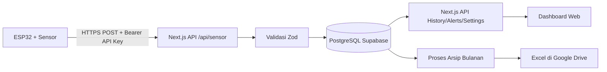
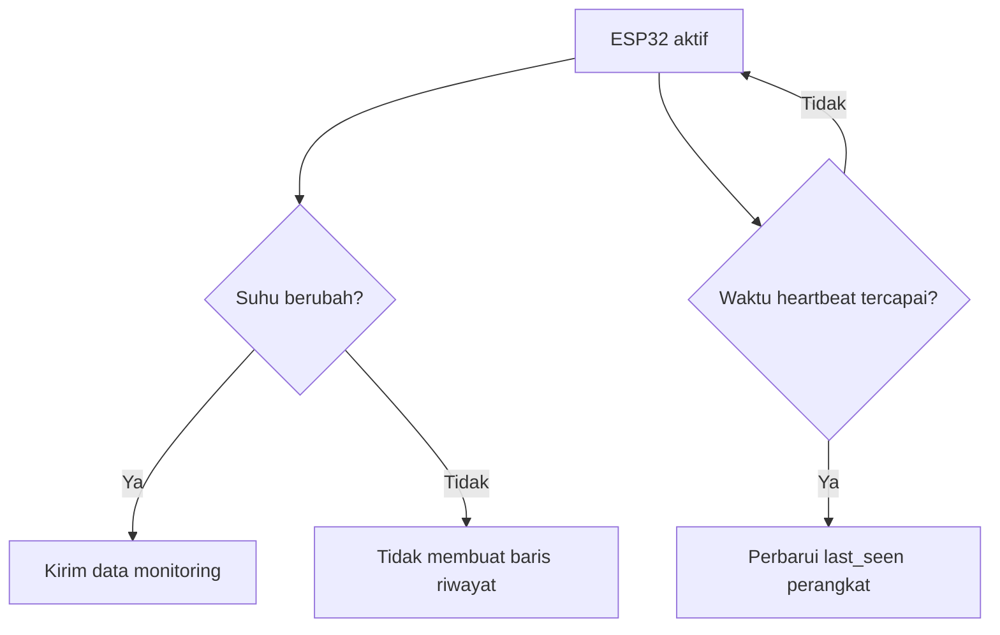

# Product Requirements Document (PRD)

## Server Room Monitoring System

| Atribut | Nilai |
|---|---|
| Nama produk | Server Room Monitoring System |
| Versi dokumen | 2.0 |
| Status | Aktif dikembangkan |
| Platform | Web responsif / desktop browser |
| Bahasa antarmuka | Indonesia |
| Zona waktu utama | WIB (`Asia/Jakarta`) |
| Repository | `elsaaa25/server-room-monitoring` |
| Lingkungan produksi | Vercel |
| Database | PostgreSQL Supabase |
| Terakhir diperbarui | 23 Juli 2026 |

---

## 1. Ringkasan Produk

Server Room Monitoring System adalah aplikasi web untuk memantau kondisi ruang server secara hampir real-time. Sistem menerima pembacaan sensor dari ESP32 melalui API HTTPS, menyimpan data ke PostgreSQL Supabase, menampilkan kondisi terkini pada dashboard, menyediakan grafik dan riwayat, serta membuat peringatan ketika suhu melewati batas yang telah ditentukan.

Versi saat ini berfokus pada sensor suhu Lantai 4 dengan identitas `TEMP-L4`. Sistem dirancang agar dapat diperluas untuk suhu Lantai 5, tegangan, arus, dan jenis sensor lain tanpa mengubah fondasi utama aplikasi.

Produk ini tidak mengendalikan AC atau aktuator. Fungsi utamanya adalah monitoring, pencatatan, visualisasi, peringatan, dan pengarsipan data.

---

## 2. Latar Belakang Masalah

Ruang server membutuhkan kondisi suhu yang stabil. Pemantauan manual memiliki beberapa keterbatasan:

- kondisi ruangan tidak selalu diperiksa setiap saat;
- kenaikan suhu dapat terlambat diketahui;
- tidak tersedia riwayat yang rapi untuk analisis;
- status sensor sulit diketahui ketika perangkat terputus;
- data yang sama dapat tersimpan berulang kali dan memperbesar beban database;
- laporan bulanan membutuhkan proses manual.

Sistem ini dibuat untuk menyediakan satu pusat monitoring yang mudah diakses melalui komputer, menampilkan informasi penting secara cepat, dan menyimpan rekam data yang dapat ditinjau kembali.

---

## 3. Tujuan Produk

### 3.1 Tujuan Utama

1. Menampilkan kondisi suhu ruang server secara jelas dan hampir real-time.
2. Memberikan peringatan saat suhu memasuki kondisi waspada atau bahaya.
3. Menyediakan grafik perubahan suhu yang mudah dibaca.
4. Menyediakan riwayat pembacaan sensor dalam zona waktu WIB.
5. Menampilkan status sensor online atau offline.
6. Menyediakan pengaturan batas suhu yang hanya dapat diubah administrator.
7. Mengarsipkan data bulanan ke Google Drive dalam format Excel.
8. Mengurangi data berulang dengan mencatat perubahan nilai, bukan menyimpan nilai identik secara terus-menerus.

### 3.2 Sasaran Keberhasilan

- Data terbaru dapat tampil tanpa reload halaman.
- Grafik dapat terbuka dengan cepat dan tetap responsif pada riwayat besar.
- Peringatan tidak dibuat berulang untuk satu siklus kondisi yang sama.
- Data yang sudah berhasil diarsipkan dapat dihapus secara aman tanpa menghapus data yang belum terverifikasi.
- Operator dapat memahami kondisi ruang server dalam waktu kurang dari satu menit setelah membuka dashboard.

---

## 4. Ruang Lingkup

### 4.1 Termasuk dalam Produk

- autentikasi pengguna;
- role `ADMIN` dan `OPERATOR`;
- monitoring suhu Lantai 4;
- dukungan desain untuk suhu Lantai 5;
- pembacaan tegangan sebagai data opsional;
- pengembangan berikutnya untuk arus listrik;
- dashboard ringkasan;
- grafik periode 1 jam, 6 jam, 24 jam, dan 7 hari;
- halaman riwayat;
- halaman peringatan;
- halaman pengaturan;
- status sensor online/offline;
- ekspor CSV dari halaman grafik;
- arsip Excel bulanan ke Google Drive;
- ringkasan harian dalam file Excel;
- penyimpanan data PostgreSQL Supabase;
- deployment aplikasi melalui Vercel;
- tampilan responsif untuk desktop, tablet, dan mobile.

### 4.2 Dalam Pengembangan

- pencatatan data berbasis perubahan suhu;
- heartbeat perangkat yang terpisah dari data historis;
- optimasi grafik dashboard agar tidak memuat ulang seluruh riwayat saat polling;
- ekspor bulanan menggunakan data asli database;
- finalisasi proses penghapusan aman setelah arsip diverifikasi;
- sensor suhu Lantai 5;
- sensor tegangan aktual;
- sensor arus aktual.

### 4.3 Tidak Termasuk Saat Ini

- kontrol otomatis AC, kipas, atau aktuator;
- aplikasi Android/iOS native;
- prediksi suhu dengan machine learning;
- multi-tenant;
- banyak instansi dalam satu instalasi;
- notifikasi WhatsApp, Telegram, atau SMS;
- monitoring kamera/CCTV;
- kontrol kelistrikan jarak jauh.

---

## 5. Pengguna dan Hak Akses

### 5.1 Operator

Operator bertugas memantau kondisi dan menindaklanjuti peringatan.

Hak akses:

- login ke aplikasi;
- melihat dashboard;
- melihat grafik;
- melihat riwayat;
- melihat peringatan;
- melihat status sensor;
- mengekspor data yang disediakan UI;
- menandai atau menangani peringatan sesuai fitur yang tersedia.

Operator tidak dapat mengubah pengaturan sistem global.

### 5.2 Administrator

Administrator memiliki semua akses operator dan tambahan:

- membuka halaman pengaturan;
- mengubah batas suhu waspada dan bahaya;
- mengubah interval pembaruan dashboard;
- mengubah batas waktu sensor offline;
- mengelola nama dan identitas sensor yang disediakan sistem;
- mengaktifkan atau menonaktifkan opsi notifikasi browser dan suara;
- membuat akun pengguna melalui mekanisme administrasi proyek.

---

## 6. Alur Sistem Utama



### 6.1 Alur Pembacaan Sensor

1. ESP32 membaca nilai sensor.
2. Nilai dibulatkan sesuai ketelitian yang dipakai sistem.
3. ESP32 membandingkan nilai saat ini dengan nilai terakhir yang berhasil dikirim.
4. Data monitoring dikirim ketika terjadi perubahan yang memenuhi ambang perubahan.
5. API memvalidasi identitas perangkat, format payload, dan rentang nilai.
6. Data valid disimpan ke `sensor_readings`.
7. Sistem mengevaluasi batas suhu.
8. Sistem membuka, menaikkan level, atau menutup siklus peringatan.
9. Dashboard mengambil data terbaru dan memperbarui tampilan.

### 6.2 Alur Heartbeat yang Direncanakan

Heartbeat digunakan agar perangkat tetap dapat dinilai online ketika suhu tidak berubah dalam waktu lama.



Heartbeat tidak boleh menambahkan titik baru ke grafik suhu.

---

## 7. Kebutuhan Fungsional

### FR-001 — Autentikasi

- Pengguna login menggunakan email dan password.
- Password disimpan dalam bentuk hash.
- Sesi menggunakan JWT.
- Durasi sesi bawaan adalah 8 jam.
- Pengguna tidak aktif tidak dapat login.
- Pengguna yang belum login diarahkan ke halaman login.

### FR-002 — Otorisasi Role

- Role yang tersedia adalah `ADMIN` dan `OPERATOR`.
- Halaman pengaturan hanya dapat diakses `ADMIN`.
- Endpoint perubahan pengaturan harus memeriksa sesi dan role di server.
- Pembatasan UI tidak boleh menjadi satu-satunya pengamanan.

### FR-003 — Penerimaan Data Sensor

Endpoint utama:

```text
POST /api/sensor
```

Ketentuan:

- request menggunakan `Content-Type: application/json`;
- request menggunakan header `Authorization: Bearer <SENSOR_API_KEY>`;
- sensor aktif saat ini menggunakan `sensorId: "TEMP-L4"`;
- `temperature` wajib berupa angka finite;
- rentang suhu valid adalah -40°C sampai 100°C;
- `voltage` bersifat opsional;
- rentang tegangan valid adalah 0 sampai 300 V;
- request tidak sah mengembalikan status 401;
- payload tidak valid mengembalikan status 400;
- data valid mengembalikan status 201.

Contoh payload:

```json
{
  "sensorId": "TEMP-L4",
  "temperature": 23.6,
  "voltage": 220.4
}
```

### FR-004 — Monitoring Berbasis Perubahan

Sistem target harus mencatat perubahan nilai, bukan setiap hasil pembacaan yang sama.

Aturan awal:

- suhu dibulatkan menjadi satu angka di belakang koma;
- data suhu dikirim ketika suhu berubah minimal 0,1°C dari nilai terakhir yang berhasil dikirim;
- perubahan tegangan dapat menggunakan ambang awal 1 V;
- nilai terakhir hanya diperbarui di ESP32 setelah server berhasil menerima data;
- kegagalan pengiriman harus dicoba kembali;
- data identik tidak membuat baris baru di `sensor_readings`.

Contoh:

| Waktu | Nilai | Aksi |
|---|---:|---|
| 10:00:00 | 23,5°C | Simpan |
| 10:00:15 | 23,5°C | Abaikan |
| 10:00:30 | 23,5°C | Abaikan |
| 10:00:45 | 23,6°C | Simpan |

Catatan: sensor tetap membaca secara periodik agar dapat mendeteksi perubahan. Yang diubah adalah kebijakan pengiriman dan penyimpanannya.

### FR-005 — Heartbeat dan Status Online

- Perangkat harus mengirim heartbeat terpisah secara periodik.
- Interval awal yang direkomendasikan adalah 60 detik.
- Heartbeat memperbarui `last_seen` tanpa membuat data grafik baru.
- Sensor dinyatakan online jika selisih waktu saat ini dengan `last_seen` masih berada dalam `offline_timeout`.
- Sensor dinyatakan offline jika melewati batas tersebut.
- Sampai heartbeat tersedia, sistem dapat menggunakan `recorded_at` data terakhir sebagai fallback.

### FR-006 — Dashboard Utama

Dashboard harus menampilkan:

- suhu terbaru;
- tegangan terbaru jika tersedia;
- status sensor;
- kondisi ruangan;
- waktu pembaruan terakhir;
- grafik suhu;
- grafik tegangan;
- batas normal, waspada, dan bahaya;
- status koneksi sistem;
- suhu tertinggi, terendah, dan rata-rata;
- lima pembacaan terbaru;
- tautan ke riwayat dan peringatan.

Dashboard menyediakan pilihan Lantai 4 dan Lantai 5. Ketika sensor Lantai 5 belum tersedia, UI harus menampilkan status belum ada data dan tidak menggunakan data simulasi sebagai data nyata.

### FR-007 — Grafik Dashboard

- Pilihan periode: 1 jam, 6 jam, dan 24 jam.
- Data harus diurutkan dari waktu lama ke waktu terbaru.
- Grafik suhu dan tegangan menggunakan skala Y terpisah.
- Garis batas suhu mengikuti pengaturan database.
- Grafik tidak boleh memuat ulang seluruh riwayat pada setiap polling.
- Riwayat penuh dimuat ketika halaman, lantai, atau periode berubah.
- Polling berikutnya hanya mengambil data terbaru.
- Jumlah titik yang dirender dibatasi, dengan nilai awal maksimal 300 titik.
- Animasi Recharts dinonaktifkan untuk pembaruan realtime berulang.
- Jika hanya ada satu titik, grafik menampilkan dot agar data tetap terlihat.
- Grafik menggunakan WIB pada sumbu dan tooltip.

### FR-008 — Halaman Grafik

Halaman grafik harus menyediakan:

- periode 1 jam, 6 jam, 24 jam, dan 7 hari;
- kartu nilai terakhir dan rata-rata;
- grafik suhu Lantai 4 menggunakan data asli;
- placeholder yang jelas untuk sensor yang belum tersedia;
- pemisahan grafik suhu, tegangan, dan arus;
- tombol pembaruan manual;
- informasi waktu pembaruan terakhir;
- export CSV;
- status loading, kosong, dan error;
- maksimal titik render untuk menjaga performa.

### FR-009 — Riwayat Sensor

Endpoint utama:

```text
GET /api/sensor/history
```

Filter yang didukung:

- `sensorId`;
- `hours`;
- `date`;
- `limit`.

Ketentuan:

- hanya pengguna login yang dapat mengakses data;
- urutan default adalah terbaru ke terlama;
- filter tanggal menggunakan WIB;
- API mengembalikan `id`, `sensorId`, `temperature`, `voltage`, dan `recordedAt`;
- UI menyediakan pencarian/filter yang relevan;
- jumlah data yang dimuat harus dibatasi untuk mencegah query berlebihan.

### FR-010 — Klasifikasi Suhu

Nilai bawaan:

| Status | Kondisi |
|---|---|
| Normal | Suhu < batas waspada |
| Waspada | Suhu ≥ batas waspada dan < batas bahaya |
| Bahaya | Suhu ≥ batas bahaya |

Nilai awal:

- batas waspada: 27°C;
- batas bahaya: 30°C.

Nilai aktual harus dibaca dari tabel `monitoring_settings`.

### FR-011 — Sistem Peringatan

- Peringatan dibuat ketika suhu masuk level waspada atau bahaya.
- Hanya boleh ada satu peringatan aktif per sensor.
- Perubahan dari waspada ke bahaya dianggap eskalasi.
- Peringatan waspada sebelumnya ditutup ketika terjadi eskalasi ke bahaya.
- Ketika suhu kembali normal, siklus peringatan aktif ditutup.
- Peringatan menyimpan nilai suhu, level, judul, detail, dan waktu.
- Peringatan dapat memiliki status `Aktif` atau `Ditangani`.
- Relasi ke pembacaan menggunakan `ON DELETE SET NULL` agar arsip riwayat tidak menghapus catatan peringatan.

### FR-012 — Pengaturan Monitoring

Pengaturan global mencakup:

- batas suhu waspada;
- batas suhu bahaya;
- interval pembaruan dashboard;
- batas waktu sensor offline;
- nama sensor;
- ID sensor;
- notifikasi browser;
- suara peringatan.

Aturan:

- batas bahaya harus lebih tinggi dari batas waspada;
- hanya administrator yang dapat menyimpan perubahan;
- nilai disimpan pada record global;
- perubahan pengaturan dapat disebarkan ke UI tanpa reload penuh.

### FR-013 — Export CSV

- Halaman grafik dapat mengekspor data periode terpilih ke CSV.
- Kolom menggunakan waktu WIB.
- Kolom suhu, tegangan, dan arus dipisahkan.
- Data yang belum tersedia dibiarkan kosong, bukan diisi nilai simulasi.

### FR-014 — Arsip Excel Bulanan

Sistem target membuat satu file `.xlsx` untuk setiap bulan kalender.

Nama file yang direkomendasikan:

```text
monitoring-ruang-server-YYYY-MM.xlsx
```

Sheet wajib:

1. `Data Sensor`
2. `Ringkasan Harian`

Format `Data Sensor`:

| No. | Tanggal dan Waktu WIB | Suhu Lantai 4 (°C) | Suhu Lantai 5 (°C) | Tegangan (V) | Arus (A) |
|---:|---|---:|---:|---:|---:|

Format `Ringkasan Harian` minimal berisi:

- tanggal;
- jumlah sampel;
- rata-rata, minimum, dan maksimum suhu Lantai 4;
- rata-rata, minimum, dan maksimum suhu Lantai 5;
- rata-rata, minimum, dan maksimum tegangan;
- rata-rata, minimum, dan maksimum arus.

Ketentuan:

- file diunggah ke folder Google Drive yang telah dikonfigurasi;
- autentikasi Google menggunakan OAuth 2.0 dan refresh token;
- status ekspor dicatat dalam `monthly_export_logs`;
- file tidak boleh dianggap selesai sebelum jumlah baris diverifikasi.

### FR-015 — Finalisasi Arsip dan Penghapusan Aman

- Data hanya dihapus setelah upload Google Drive berhasil.
- Jumlah baris yang diekspor harus sama dengan jumlah baris yang akan dihapus.
- Penghapusan hanya mencakup bulan arsip tertentu.
- Sistem dilarang menggunakan `TRUNCATE` untuk proses ini.
- Proses final menggunakan fungsi database `finalize_monthly_sensor_archive(date)`.
- Peringatan tetap dipertahankan walaupun `reading_id` menjadi null.
- Kegagalan proses harus mengubah status log menjadi gagal dan tidak menghapus data.

### FR-016 — Zona Waktu

- Seluruh tampilan pengguna menggunakan WIB.
- Zona waktu canonical adalah `Asia/Jakarta`.
- Timestamp database tetap menggunakan `TIMESTAMPTZ`.
- Filter tanggal harus menghitung batas hari berdasarkan WIB.
- File CSV dan Excel menggunakan label waktu WIB.

---

## 8. Halaman dan Navigasi

| Halaman | Route | Akses | Fungsi utama |
|---|---|---|---|
| Login | `/login` | Publik | Autentikasi pengguna |
| Dashboard | `/` | Login | Ringkasan kondisi dan grafik utama |
| Grafik | `/grafik` | Login | Analisis grafik periode panjang |
| Riwayat | `/riwayat` | Login | Tabel historis dan filter |
| Peringatan | `/peringatan` | Login | Daftar dan penanganan alarm |
| Pengaturan | `/pengaturan` | Admin | Konfigurasi sistem |

Navigasi menggunakan sidebar pada desktop dan drawer pada mobile.

---

## 9. Spesifikasi UI/UX

### 9.1 Prinsip Tampilan

- antarmuka bersih dan profesional;
- informasi kritis terlihat tanpa banyak langkah;
- desain responsif;
- kartu dengan border tipis, sudut membulat, dan bayangan ringan;
- menggunakan komponen Shadcn UI;
- ikon menggunakan Lucide React;
- grafik menggunakan Recharts.

### 9.2 Warna Status

| Status | Warna utama |
|---|---|
| Normal | Hijau |
| Waspada | Amber/oranye |
| Bahaya | Merah/rose |
| Tidak tersedia | Abu-abu |
| Informasi | Biru |

Status tidak boleh disampaikan hanya melalui warna. UI juga harus menggunakan teks, ikon, atau label.

### 9.3 State Wajib

Setiap komponen data harus memiliki state:

- loading;
- data tersedia;
- data kosong;
- error;
- sensor offline;
- sensor belum tersedia.

---

## 10. Arsitektur Teknis

### 10.1 Stack

| Area | Teknologi |
|---|---|
| Framework | Next.js 16 App Router |
| Bahasa | TypeScript |
| UI | React, Shadcn UI, Tailwind CSS |
| Grafik | Recharts |
| Validasi | Zod |
| Autentikasi | Auth.js / NextAuth Credentials |
| Password hashing | bcryptjs |
| Database | PostgreSQL Supabase |
| Driver database | `pg` |
| Hosting | Vercel |
| Excel | ExcelJS |
| Google Drive | Google APIs SDK |

### 10.2 Komponen Utama

```text
ESP32
  └── HTTPS POST /api/sensor
        ├── autentikasi SENSOR_API_KEY
        ├── validasi Zod
        ├── transaksi PostgreSQL
        ├── insert sensor_readings
        └── evaluasi temperature_alerts

Browser
  ├── Auth.js session
  ├── GET /api/settings
  ├── GET /api/sensor/history
  ├── API peringatan
  └── polling data terbaru

Cron arsip
  ├── query data bulan sebelumnya
  ├── buat Excel
  ├── upload Google Drive
  ├── verifikasi jumlah data
  └── finalisasi penghapusan aman
```

### 10.3 Strategi Realtime

Versi saat ini menggunakan polling HTTP karena sederhana dan kompatibel dengan deployment serverless.

Strategi performa:

- riwayat penuh dimuat hanya saat konteks berubah;
- polling hanya meminta satu atau beberapa data terbaru;
- permintaan yang masih berjalan tidak boleh ditumpuk;
- polling dihentikan atau dikurangi ketika tab tidak aktif;
- grafik dirender dengan jumlah titik terbatas;
- data yang sama tidak ditambahkan ke state grafik;
- pada tahap sensor, data identik tidak dikirim ke server.

WebSocket atau Server-Sent Events dapat dipertimbangkan ketika kebutuhan realtime dan jumlah perangkat meningkat.

---

## 11. Model Data

### 11.1 `users`

| Kolom | Keterangan |
|---|---|
| `id` | UUID primary key |
| `name` | Nama pengguna |
| `email` | Email unik |
| `password_hash` | Hash password |
| `role` | `OPERATOR` atau `ADMIN` |
| `is_active` | Status akun |
| `created_at` | Waktu dibuat |
| `updated_at` | Waktu diperbarui |

### 11.2 `sensor_readings`

| Kolom | Keterangan |
|---|---|
| `id` | Serial primary key |
| `sensor_id` | Identitas sensor |
| `temperature` | Suhu dalam °C |
| `voltage` | Tegangan opsional |
| `recorded_at` | Waktu perekaman |

Indeks utama:

```text
(sensor_id, recorded_at DESC)
```

Pengembangan model berikutnya perlu mempertimbangkan salah satu pendekatan:

1. menambah kolom `current` dan kolom metrik lainnya; atau
2. mengubah ke model generik `metric`, `value`, dan `unit`.

Keputusan harus dibuat sebelum sensor arus mulai diproduksikan.

### 11.3 `temperature_alerts`

| Kolom | Keterangan |
|---|---|
| `id` | Primary key |
| `reading_id` | Referensi pembacaan, nullable saat data diarsipkan |
| `sensor_id` | Identitas sensor |
| `level` | `Waspada` atau `Bahaya` |
| `status` | `Aktif` atau `Ditangani` |
| `temperature` | Nilai saat peringatan dibuat |
| `title` | Judul peringatan |
| `detail` | Penjelasan tindakan |
| `created_at` | Waktu dibuat |
| `acknowledged_at` | Waktu diakui |
| `resolved_at` | Waktu siklus selesai |
| `handled_by` | Pengguna yang menangani |

Hanya boleh ada satu peringatan aktif per sensor.

### 11.4 `monitoring_settings`

| Kolom | Keterangan |
|---|---|
| `id` | Record global |
| `warning_temperature` | Batas waspada |
| `danger_temperature` | Batas bahaya |
| `refresh_interval` | Interval polling UI |
| `offline_timeout` | Batas offline sensor |
| `sensor_name` | Nama sensor |
| `sensor_id` | ID sensor |
| `browser_notification` | Toggle notifikasi browser |
| `sound_alert` | Toggle suara |
| `updated_at` | Waktu perubahan |

### 11.5 `monthly_export_logs`

Tabel ini mencatat proses arsip bulanan.

Kolom minimal yang dibutuhkan:

- bulan arsip;
- status proses;
- jumlah data sumber;
- jumlah data yang diekspor;
- ID file Google Drive;
- URL file;
- pesan error;
- waktu mulai dan selesai.

Status yang direkomendasikan:

```text
PROCESSING → UPLOADED → COMPLETED
                  └──→ FAILED
```

### 11.6 `sensor_status` — Direncanakan

Tabel status perangkat diperlukan untuk heartbeat.

Kolom minimum:

- `sensor_id`;
- `last_seen`;
- `last_temperature`;
- `last_voltage`;
- `firmware_version` opsional;
- `updated_at`.

---

## 12. API dan Kontrak

### 12.1 Sensor

| Method | Endpoint | Akses | Fungsi |
|---|---|---|---|
| POST | `/api/sensor` | Bearer API key | Menyimpan pembacaan sensor |
| GET | `/api/sensor/history` | Login | Mengambil riwayat sensor |

### 12.2 Pengaturan

| Method | Endpoint | Akses | Fungsi |
|---|---|---|---|
| GET | `/api/settings` | Aplikasi | Membaca pengaturan global |
| POST | `/api/settings` | Admin | Mengubah pengaturan global |

### 12.3 Autentikasi

Auth.js menangani route autentikasi melalui:

```text
/api/auth/[...nextauth]
```

### 12.4 Google Drive dan Arsip

Route yang digunakan atau direncanakan:

- OAuth start;
- OAuth callback;
- test upload Google Drive;
- test Excel;
- cron ekspor bulanan.

Route test harus dibatasi pada development atau dihapus setelah integrasi produksi selesai.

### 12.5 Format Error

Format respons error yang konsisten:

```json
{
  "success": false,
  "error": "Pesan singkat",
  "details": "Detail aman untuk debugging"
}
```

Stack trace, credential, dan connection string tidak boleh dikirim ke browser.

---

## 13. Keamanan

- Rahasia disimpan dalam environment variable.
- `SENSOR_API_KEY` tidak ditulis di repository.
- Endpoint sensor menggunakan Bearer token.
- Password disimpan menggunakan bcrypt.
- Pengaturan hanya dapat diubah administrator.
- Query menggunakan parameter PostgreSQL untuk mencegah SQL injection.
- Koneksi database menggunakan SSL.
- Route riwayat memerlukan sesi pengguna.
- Refresh token Google tidak boleh ditampilkan pada client.
- `CRON_SECRET` melindungi endpoint cron.
- Log produksi tidak boleh mencetak password atau rahasia.
- Route pengujian integrasi tidak boleh aktif secara terbuka di produksi.

Environment variable utama:

```text
DB_HOST
DB_PORT
DB_NAME
DB_USER
DB_PASSWORD
AUTH_SECRET
SENSOR_API_KEY
GOOGLE_CLIENT_ID
GOOGLE_CLIENT_SECRET
GOOGLE_REDIRECT_URI
GOOGLE_REFRESH_TOKEN
GOOGLE_DRIVE_FOLDER_ID
CRON_SECRET
```

---

## 14. Kebutuhan Nonfungsional

### NFR-001 — Performa

- dashboard awal ditargetkan tampil dalam waktu kurang dari 3 detik pada koneksi normal;
- API pembacaan terbaru ditargetkan merespons kurang dari 500 ms pada beban normal;
- grafik tidak merender lebih dari 300–360 titik sekaligus;
- query riwayat harus menggunakan indeks waktu dan sensor;
- polling tidak boleh mengambil ribuan baris secara berulang.

### NFR-002 — Reliabilitas

- kegagalan satu payload tidak menghentikan sistem;
- transaksi pembacaan dan peringatan harus rollback jika terjadi error;
- data terakhir tetap ditampilkan ketika polling terbaru gagal;
- permintaan polling tidak boleh saling menumpuk;
- proses arsip gagal tidak boleh menghapus data sumber.

### NFR-003 — Skalabilitas

- desain ID sensor harus mendukung lebih dari satu sensor;
- query selalu mendukung filter sensor;
- tabel menggunakan indeks yang sesuai;
- model data metrik perlu disiapkan sebelum penambahan banyak jenis sensor.

### NFR-004 — Aksesibilitas

- tombol memiliki label yang jelas;
- status tidak bergantung pada warna saja;
- navigasi dapat digunakan melalui keyboard;
- kontras warna cukup;
- layout tetap terbaca pada layar kecil.

### NFR-005 — Maintainability

- TypeScript digunakan pada frontend dan API;
- validasi request menggunakan Zod;
- fungsi format waktu menggunakan `Asia/Jakarta` secara konsisten;
- perubahan besar harus memperbarui PRD dan changelog;
- kode test sementara harus diberi penanda dan dihapus setelah selesai.

---

## 15. Kriteria Penerimaan

### 15.1 Sensor dan API

- [ ] ESP32 berhasil mengirim data dengan Bearer API key.
- [ ] Payload invalid ditolak.
- [ ] `TEMP-L4` tersimpan di database.
- [ ] Data identik tidak disimpan berulang setelah change-based monitoring aktif.
- [ ] Heartbeat memperbarui status tanpa menambah riwayat.

### 15.2 Dashboard

- [ ] Suhu terbaru tampil dari database.
- [ ] Status suhu mengikuti pengaturan.
- [ ] Sensor berubah offline setelah timeout.
- [ ] Grafik muncul tanpa delay berlebihan.
- [ ] Polling terbaru tidak memuat ulang seluruh riwayat.
- [ ] Grafik tetap terlihat saat hanya ada satu titik.
- [ ] Periode 1, 6, dan 24 jam berfungsi.

### 15.3 Grafik dan Riwayat

- [ ] Halaman grafik memakai data asli Lantai 4.
- [ ] Tidak ada nilai simulasi untuk sensor yang belum tersedia.
- [ ] Periode 7 hari berfungsi.
- [ ] Export CSV menghasilkan kolom terpisah.
- [ ] Waktu tampil dalam WIB.

### 15.4 Peringatan

- [ ] Peringatan dibuat saat masuk waspada.
- [ ] Peringatan meningkat saat masuk bahaya.
- [ ] Tidak ada duplikasi peringatan aktif.
- [ ] Siklus selesai saat suhu kembali normal.
- [ ] Catatan peringatan tidak hilang saat pembacaan diarsipkan.

### 15.5 Arsip Bulanan

- [ ] File Excel memiliki dua sheet wajib.
- [ ] Kolom suhu, tegangan, dan arus terpisah.
- [ ] File berhasil masuk ke folder Google Drive yang ditentukan.
- [ ] Jumlah data sumber dan ekspor cocok.
- [ ] Finalisasi hanya menghapus bulan yang telah diverifikasi.
- [ ] Kegagalan upload tidak menghapus data.

### 15.6 Keamanan

- [ ] Halaman privat tidak dapat dibuka tanpa login.
- [ ] Operator tidak dapat mengubah pengaturan.
- [ ] API key dan token tidak tersedia pada client.
- [ ] Route test tidak terbuka di produksi.

---

## 16. Pengujian

### 16.1 Unit Test yang Direkomendasikan

- klasifikasi normal/waspada/bahaya;
- validasi payload sensor;
- pembulatan perubahan suhu;
- penyaringan data identik;
- perhitungan min/max/rata-rata;
- pembentukan rentang bulan WIB;
- pemetaan data Excel;
- verifikasi jumlah data arsip.

### 16.2 Integration Test

- ESP32/API ke PostgreSQL;
- insert pembacaan dan pembuatan peringatan dalam transaksi;
- riwayat dengan filter sensor, jam, tanggal, dan limit;
- login dan role;
- upload file ke Google Drive;
- fungsi finalisasi arsip.

### 16.3 End-to-End Test

- login sebagai operator;
- melihat dashboard;
- mengganti periode grafik;
- melihat peringatan;
- login sebagai admin dan mengubah batas;
- menguji suhu normal, waspada, bahaya, lalu normal kembali;
- menguji sensor berhenti mengirim;
- menguji export CSV dan arsip bulanan.

---

## 17. Status Implementasi

| Area | Status | Catatan |
|---|---|---|
| Next.js dan UI | Selesai dasar | App Router, Shadcn UI, responsif |
| Login | Selesai | Auth.js Credentials, JWT |
| Role admin/operator | Selesai dasar | Pengaturan dibatasi admin |
| PostgreSQL Supabase | Selesai | Driver `pg` |
| Sensor Lantai 4 | Aktif | ID `TEMP-L4` |
| Sensor Lantai 5 | Belum tersedia | UI disiapkan |
| API sensor | Selesai dasar | Suhu + tegangan opsional |
| Dashboard | Aktif dikembangkan | Optimasi grafik/polling |
| Halaman grafik | Aktif dikembangkan | L4 realtime tersedia |
| Riwayat | Tersedia | Filter melalui API |
| Peringatan | Tersedia | Siklus waspada/bahaya |
| Pengaturan | Tersedia | Global settings |
| Change-based monitoring | Direncanakan dekat | Perlu perubahan ESP32 + heartbeat |
| Google OAuth/Drive | Teruji dasar | Upload file test berhasil |
| Excel bulanan | Teruji dengan mock | Integrasi data asli belum final |
| Penghapusan arsip aman | Database siap | Eksekusi produksi belum dilakukan |
| Email laporan | Belum dikerjakan | Pengembangan berikutnya |

---

## 18. Roadmap

### Fase 1 — Fondasi — Selesai

- Next.js dan Shadcn UI;
- PostgreSQL Supabase;
- autentikasi;
- dashboard awal;
- deployment Vercel.

### Fase 2 — Monitoring Suhu L4 — Selesai Dasar

- endpoint sensor;
- sensor `TEMP-L4`;
- riwayat;
- grafik;
- status;
- peringatan;
- pengaturan.

### Fase 3 — Optimasi Realtime — Sedang Berjalan

- pemuatan riwayat satu kali;
- polling hanya data terbaru;
- pembatasan titik grafik;
- pencatatan berbasis perubahan;
- heartbeat perangkat;
- pemisahan status online dari riwayat.

### Fase 4 — Arsip Bulanan — Sedang Berjalan

- OAuth Google;
- upload Google Drive;
- workbook Excel;
- data asli database;
- verifikasi jumlah data;
- finalisasi aman;
- cron produksi.

### Fase 5 — Penambahan Sensor

- suhu Lantai 5;
- sensor tegangan aktual;
- sensor arus;
- penyesuaian model data;
- grafik dan ringkasan per metrik.

### Fase 6 — Notifikasi dan Operasional

- browser notification;
- suara peringatan;
- email laporan;
- dokumentasi operasional;
- backup dan restore;
- audit log perubahan pengaturan.

---

## 19. Risiko dan Mitigasi

| Risiko | Dampak | Mitigasi |
|---|---|---|
| Data identik tersimpan terus | Database membesar cepat | Change-based monitoring + heartbeat |
| Suhu stabil membuat sensor dianggap offline | Status salah | Pisahkan `last_seen` dari `sensor_readings` |
| Riwayat 24 jam sangat besar | Grafik lambat | Limit API, incremental polling, downsampling |
| Upload Drive berhasil tetapi log gagal | Status arsip tidak konsisten | Transaksi status dan proses idempotent |
| Data terhapus sebelum file valid | Kehilangan data | Verifikasi row count dan fungsi finalisasi |
| API key bocor | Data palsu masuk | Rotasi secret, Bearer auth, jangan commit secret |
| Sensor baru butuh skema berbeda | Refactor besar | Putuskan model metrik sebelum produksi multi-sensor |
| Waktu berbeda antara server dan UI | Filter salah | Gunakan TIMESTAMPTZ + `Asia/Jakarta` |
| Route test aktif di produksi | Risiko keamanan | Blokir berdasarkan environment atau hapus |

---

## 20. Keputusan Produk yang Masih Terbuka

1. Ambang perubahan suhu final: 0,1°C atau 0,2°C.
2. Interval heartbeat final: 60 detik atau menyesuaikan `offline_timeout`.
3. Model penyimpanan multi-metrik:
   - kolom tetap (`temperature`, `voltage`, `current`); atau
   - model generik (`metric`, `value`, `unit`).
4. Apakah arsip bulanan dijalankan tanggal 1 pukul tertentu dalam WIB.
5. Kebijakan retensi data setelah arsip.
6. Apakah file bulanan dikirim juga melalui email.
7. Mekanisme acknowledgement peringatan oleh operator.
8. Apakah status perangkat membutuhkan informasi firmware dan kekuatan Wi-Fi.

---

## 21. Tata Kelola dan Pembaruan PRD

Dokumen ini adalah sumber kebutuhan produk utama. PRD harus diperbarui ketika terjadi salah satu kondisi berikut:

- penambahan atau penghapusan fitur;
- perubahan endpoint atau kontrak payload;
- perubahan tabel database;
- perubahan aturan status, alarm, atau retensi;
- perubahan integrasi sensor;
- perubahan arsitektur realtime;
- perubahan proses arsip;
- perubahan role dan keamanan;
- perubahan deployment penting.

### 21.1 Aturan Versi

- perubahan kecil atau klarifikasi: naikkan versi minor, misalnya `2.0` menjadi `2.1`;
- perubahan ruang lingkup atau arsitektur besar: naikkan versi mayor, misalnya `2.x` menjadi `3.0`;
- setiap perubahan menambahkan baris pada changelog;
- tanggal menggunakan format `DD MMMM YYYY`;
- item roadmap dan status implementasi harus ikut diperbarui.

### 21.2 Checklist Pembaruan

- [ ] Ringkasan produk masih sesuai.
- [ ] Ruang lingkup sesuai implementasi.
- [ ] Kebutuhan fungsional diperbarui.
- [ ] Model data diperbarui.
- [ ] Endpoint diperbarui.
- [ ] Kriteria penerimaan diperbarui.
- [ ] Status implementasi diperbarui.
- [ ] Roadmap diperbarui.
- [ ] Risiko baru dicatat.
- [ ] Changelog ditambahkan.

---

## 22. Changelog

| Versi | Tanggal | Perubahan |
|---|---|---|
| 2.0 | 23 Juli 2026 | Menyusun ulang PRD berdasarkan implementasi aktual: direct HTTPS API, Auth.js, PostgreSQL Supabase, dashboard, grafik, peringatan, pengaturan, Google Drive, Excel bulanan, optimasi realtime, change-based monitoring, dan heartbeat. |
| 1.0 | Sebelumnya | Draft awal monitoring suhu yang masih menggunakan rancangan MQTT. |

---

## 23. Definition of Done Produk

Satu fitur dianggap selesai ketika:

1. kebutuhan dan kriteria penerimaan tertulis;
2. implementasi frontend/backend selesai;
3. validasi dan penanganan error tersedia;
4. role dan keamanan diperiksa;
5. build produksi berhasil;
6. pengujian utama berhasil;
7. dokumentasi teknis dan PRD diperbarui;
8. perubahan dicatat dalam changelog;
9. tidak ada data simulasi yang ditampilkan sebagai data produksi;
10. perubahan tidak merusak fitur yang sudah berjalan.
